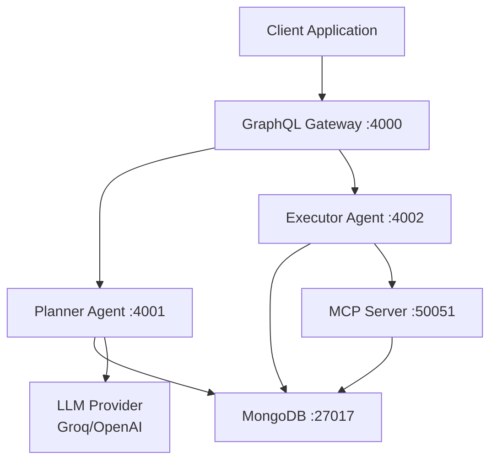
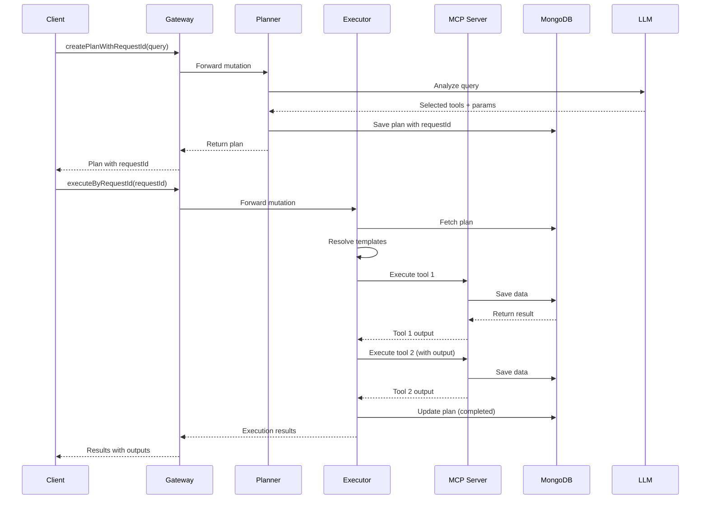

# Architecture Overview

Clear AI V4 follows a microservices architecture pattern with independent agents, a gateway, and shared infrastructure.

## High-Level Architecture



## Component Breakdown

### 1. Planner Agent (Port 4001)

**Purpose**: Analyzes natural language queries and creates execution plans.

**Responsibilities**:
- Receives GraphQL mutations for plan creation
- Uses LLM to interpret user intent
- Selects appropriate tools from available MCP tools
- Extracts parameters from natural language
- Identifies tool dependencies
- Generates request ID and plan ID
- Stores plans in MongoDB

**Key Files**:
- `packages/planner-agent/src/workflows/PlanningGraph.ts` - LLM integration
- `packages/planner-agent/src/resolvers/index.ts` - GraphQL resolvers
- `packages/planner-agent/src/schema/typeDefs.ts` - GraphQL schema

**GraphQL Schema**:
```graphql
type Mutation {
  createPlanWithRequestId(query: String!): PlanWithRequest!
}

type PlanWithRequest {
  requestId: String!
  planId: String!
  query: String!
  plan: String!
  selectedTools: [ToolExecution!]!
  toolOrder: [String!]!
  executionState: String!
}
```

### 2. Executor Agent (Port 4002)

**Purpose**: Executes planned tools sequentially with parameter resolution.

**Responsibilities**:
- Receives execution requests by request ID
- Fetches plans from MongoDB
- Resolves template parameters (e.g., `{{tool._id}}`)
- Executes tools in topological order via MCP
- Passes outputs between tools
- Updates execution state
- Returns aggregated results

**Key Files**:
- `packages/executor-agent/src/workflows/ExecutionGraph.ts` - Sequential execution
- `packages/executor-agent/src/resolvers/index.ts` - GraphQL resolvers

**GraphQL Schema**:
```graphql
type Mutation {
  executeByRequestId(requestId: ID!): ExecutionWithChaining!
}

type ExecutionWithChaining {
  requestId: String!
  totalExecutions: Int!
  successful: Int!
  failed: Int!
  outputs: String!
  errors: [String!]!
}
```

### 3. MCP Server (Port 50051)

**Purpose**: Provides gRPC interface for tool execution.

**Responsibilities**:
- Exposes available tools via gRPC
- Executes tools (createAuthor, createBlog, etc.)
- Returns structured responses
- Manages database connections

**Key Files**:
- `packages/mcp-server/src/index.ts` - gRPC server
- `packages/mcp-server/src/models/*` - Data models

**gRPC Methods**:
```protobuf
service ToolService {
  rpc ListTools(Empty) returns (ToolList);
  rpc CallTool(CallToolRequest) returns (CallToolResponse);
}
```

### 4. MongoDB (Port 27017)

**Purpose**: Persistent storage for plans and execution results.

**Collections**:
- `plans` - Execution plans with request IDs
- `authors` - Author data
- `blogs` - Blog data
- `comments` - Comment data
- `pictures` - Picture data

**Plan Schema**:
```javascript
{
  _id: ObjectId,
  requestId: String,
  planId: String,
  query: String,
  plan: String,
  selectedTools: [{
    toolName: String,
    parameters: Object,
    dependsOn: String,
    outputMapping: Object
  }],
  toolOrder: [String],
  executionState: 'pending' | 'in-progress' | 'completed' | 'failed',
  executionResults: Object,
  createdAt: Date,
  updatedAt: Date
}
```

### 5. Gateway (Port 4000)

**Purpose**: Unified GraphQL API for clients.

**Responsibilities**:
- Exposes single GraphQL endpoint
- Routes queries to appropriate services
- Combines responses from multiple services

**Implementation**:
- Schema stitching
- Request forwarding
- Response aggregation

## Data Flow

### Creating and Executing a Plan



### Tool Chaining Example

```
Query: "Create author Bob, then create blog by Bob"

Step 1: LLM Analysis
┌─────────────────────────────────────────────────────────┐
│ Tool: createAuthor                                      │
│ Parameters: {name: "Bob", email: "..."}                 │
│ DependsOn: null                                         │
└─────────────────────────────────────────────────────────┘

┌─────────────────────────────────────────────────────────┐
│ Tool: createBlog                                        │
│ Parameters: {authorId: "{{createAuthor._id}}", ...}    │
│ DependsOn: createAuthor                                 │
└─────────────────────────────────────────────────────────┘

Step 2: Execution
1. Execute createAuthor → Returns {_id: "507f1f77bcf86cd799439011"}
2. Resolve {{createAuthor._id}} → "507f1f77bcf86cd799439011"
3. Execute createBlog with authorId="507f1f77bcf86cd799439011"
```

## Shared Components

### LLM Service

Located in `packages/shared/src/services/LLMService.ts`

**Features**:
- Supports Groq (llama-3.1-8b-instant)
- Supports OpenAI (gpt-4o-mini)
- Automatic fallback logic
- Structured JSON responses

### Tool Registry

Located in `packages/shared/src/tools/ToolRegistry.ts`

**Purpose**: Manages available MCP tools

**Methods**:
- `registerTool(tool)` - Register a new tool
- `getAllTools()` - Get all available tools
- `findTool(name)` - Find tool by name

### Response Parser

Located in `packages/shared/src/services/LLMResponseParser.ts`

**Purpose**: Parse and validate LLM responses

**Validations**:
- Check for required fields
- Validate execution order
- Reject placeholder values
- Allow template references

## Communication Patterns

### 1. Request ID System

Each multi-step operation gets a unique `requestId`:

```
RequestId: req_1704123456_abc123def
PlanId: plan_1704123456_xyz789ghi
```

**Benefits**:
- Track complete operations across agents
- Query execution status
- Debug multi-step failures

### 2. Template Resolution

Template syntax: `{{toolName.field}}`

Example:
```
Input: "{{createAuthor._id}}"
Resolved: "507f1f77bcf86cd799439011"
```

### 3. Topological Sort

Execution order based on dependencies:

```
Dependencies:
  - createBlog depends on createAuthor
  - createComment depends on createBlog

Execution Order:
  1. createAuthor
  2. createBlog
  3. createComment
```

## Security Considerations

1. **API Keys**: Stored in `.env`, never committed
2. **Input Validation**: LLM responses validated before execution
3. **Database**: MongoDB uses local-only connections by default
4. **gRPC**: Secure communication between Executor and MCP
5. **Error Handling**: Failures don't expose internal state

## Scalability

Current limitations:
- Single MongoDB instance
- Local gRPC connections
- Synchronous LLM calls

Future enhancements:
- Sharding MongoDB collections
- Load balancing between agents
- Caching LLM responses
- Async execution with queues
- Service discovery

## Next Steps

- Learn about [Tool Chaining](core-concepts/tool-chaining)
- Explore [LLM Integration](core-concepts/llm-integration)
- Read the [API Reference](api-reference/planner-agent)

